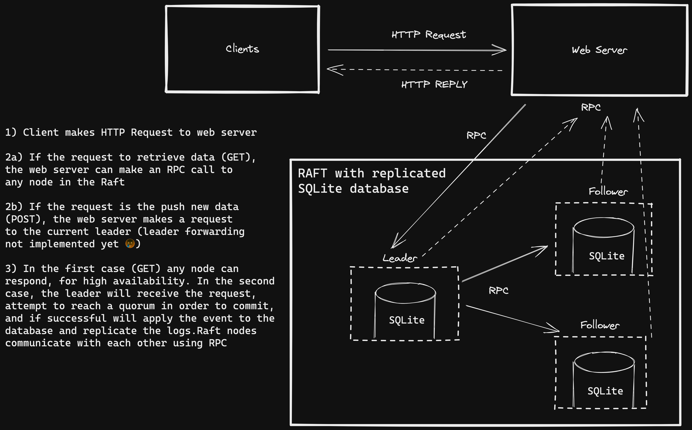

# Raft: Simple Twitter Clone

This is a simple Twitter clone that implements its distributed SQLite database using Hashicorp's implmentation of Raft.

## Architecture Overview

1. The client, which is in the `frontend` directory, is a React Application. It sends and receives HTTP requests to the web server.
2. The web server, found in the `api` directory and implemented using the `gin` framework, receives HTTP requests from the React frontend. It then forwards the request, using an RPC, to the Raft node it is pointing to. Note: Leader forwarding has not been implemented, and therefore if the node is not the leader data can only be queried.
3. The Raft node accepts the requests from the webserver. If it is adding new data, it must reach a quorum, committ the logs, and replicate. The RPCs do not go through the Raft protocol for data queries (GET requests).
4. Finally, the node reutrns the response to the server, which then forwards the data back to the client.

## Libraries Used

1. Hashicorp's Raft implementation - [hashicorp/raft] (https://github.com/hashicorp/raft)
2. The gin web server framework - [gin-gonic/gin] (https://github.com/gin-gonic/gin)
3. SQLite - [mattn/go-sqlite3] (https://github.com/mattn/go-sqlite3)
4. gRPC - [grpc/grpc-go] (https://github.com/grpc/grpc-go)

## Setup

To begin, clone the repo.

### Frontend

1. `cd frontend`
2. `npm install`
3. `npm run start`

### Web Server

The default configuration is:

	flag.StringVarP(&config.RaftAddress, "raft-address", "r",
		"127.0.0.1", "IP Address on which to bind")

	flag.IntVarP(&config.RaftPort, "raft-port", "b",
		8000, "Port on which to bind Raft")

	flag.IntVarP(&config.ServerPort, "server-port", "p",
		8080, "Port on which to bind Server")

To run:

1. `cd api`
2. `go build`
3. `./api`

With nondefault options: `./api [--raft-address=?] [--raft-port=?] [server-port=?]`

### Backend (Raft)

The default configuration is:

	flag.StringVarP(&config.DataDir, "data-dir", "d",
		defaultDataPath, "Path in which to store Raft data")

	flag.StringVarP(&config.BindAddress, "bind-address", "a",
		"127.0.0.1", "IP Address on which to bind")

	flag.IntVarP(&config.RaftPort, "raft-port", "r",
		7000, "Port on which to bind Raft")

	flag.IntVarP(&config.HTTPPort, "http-port", "h",
		8000, "Port on which to bind HTTP")

	flag.StringVar(&config.JoinAddress, "join",
		"", "Address of another node to join")

	flag.BoolVar(&config.Bootstrap, "bootstrap",
		true, "Bootstrap the cluster with this node")

To run a three node cluser:

1. `cd backend`
2. `go build`
3. For the first node: `./backend --http-port=8000 --raft-port=7000 --bootstrap`
4. For second node: `backend --http-port=8001 --raft-port=7001 --join="127.0.0.1:8000"`
5. For third node: `backend --http-port=8002 --raft-port=7002 --join="127.0.0.1:8000"`

For subsequent nodes and other options: `backend [--data-dir=?] [--http-port=?] [--raft-port=?] [--join="?"]`